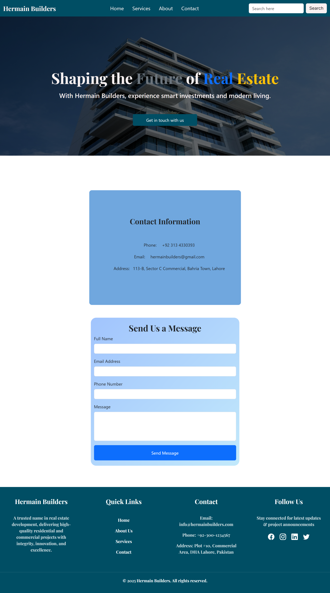

Project Overview

Hermain Builders is a modern real estate and construction company focused on delivering high-quality residential and commercial projects. This website showcases the company's services, ongoing projects, and client offerings in an intuitive and user-friendly interface.

The website is designed specially for desktop users with a clean layout, easy navigation, and professional aesthetics.

Features

Project Gallery – Display ongoing and completed construction projects with images.

Services Section – Highlights services offered such as civil construction, renovation, and property management.

Contact Form – Easy way for clients to get in touch with the company.

About Us Section – Company overview, vision, and mission statement.

Navigation Menu – Smooth scrolling to all sections for enhanced user experience.

Tech Stack

Frontend: HTML5, CSS3, JavaScript

Frameworks/Libraries: Optional Bootstrap for responsiveness, Font Awesome/Bootstrap Icons for icons

Deployment: Can be hosted on GitHub Pages, Netlify, or Vercel

Installation / Usage

Clone the repository

git clone https://github.com/ZainAhmad393/Real-Estate-Webiste.git

Open index.html in your preferred browser to view the website.

Customize content as per your project requirements (projects, images, contact info).

Screenshots

